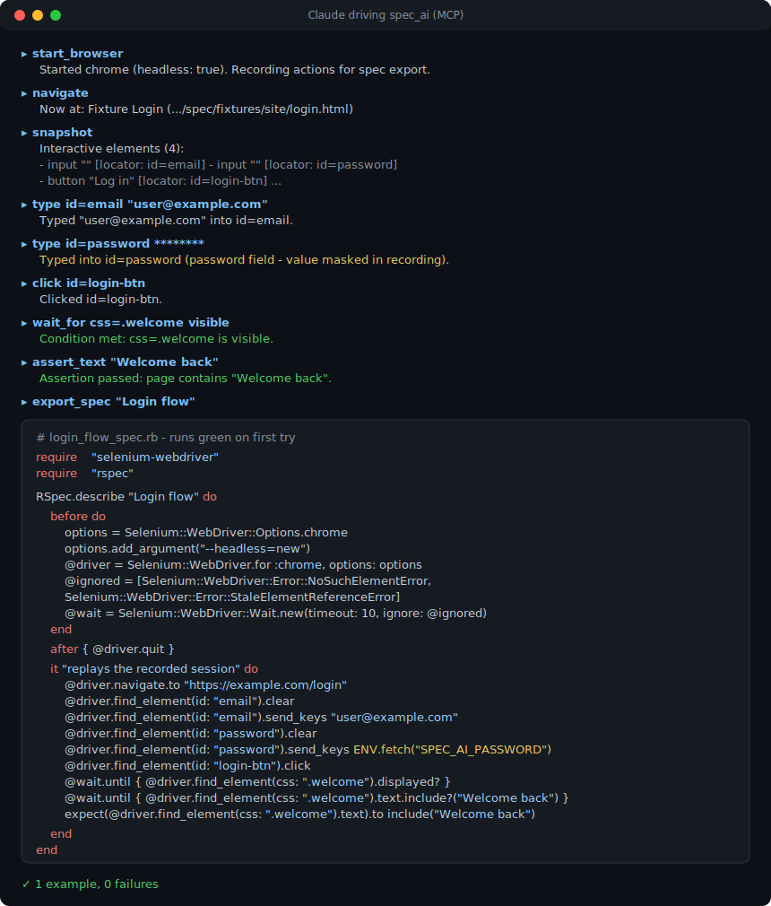

# spec_ai

**Explore with AI, keep real tests.**

A Ruby-native MCP server: Claude drives your browser through selenium-webdriver, every
action is recorded, and the session exports as a clean, runnable RSpec spec - plain
selenium-webdriver or a Capybara Rails system spec. Built on the official
[MCP Ruby SDK](https://github.com/modelcontextprotocol/ruby-sdk).

> Playwright MCP has codegen for JS. Now you have the same in Ruby.



## Install

```bash
gem install spec_ai
```

### Claude Code

```bash
claude mcp add spec-ai -- spec_ai
```

### Claude Desktop / Cursor

```json
{
  "mcpServers": {
    "spec-ai": { "command": "spec_ai" }
  }
}
```

## Tools

### Browser control (each successful call records to IR)

| Tool | Args | Returns |
|---|---|---|
| `start_browser` | browser (chrome/firefox/edge/safari), headless | session confirmation |
| `navigate` | url | title + current url |
| `snapshot` | - | compact DOM outline: interactive elements w/ suggested locators (id > name > css), text truncated, size-capped for token efficiency |
| `find_element` | locator strategy + value | element summary, or error with near-matches |
| `click` | locator | ok + resulting url/title |
| `type` | locator, text, clear: bool | ok |
| `select_option` | locator, value/text | ok |
| `screenshot` | - | image (base64) |
| `execute_script` | js | result (exported only as a `# MANUAL: review this step` comment) |
| `wait_for` | locator, condition (visible/present/gone), timeout | ok/timeout |
| `close_browser` | - | ok |

### Assertions (become `expect` lines in the export)

| Tool | Args |
|---|---|
| `assert_text` | text, optional locator scope |
| `assert_title` | expected |
| `assert_element` | locator, state (visible/present) |
| `assert_url` | pattern |

### Codegen

| Tool | Args | Returns |
|---|---|---|
| `export_spec` | description (spec name), format (`rspec` default \| `capybara`), path (optional) | generated `*_spec.rb` content + writes file |
| `reset_recording` | - | clears IR, keeps browser open |

**Notes:**

- `snapshot` is the driving-quality differentiator - the equivalent of Playwright MCP's accessibility snapshot, which mcp-selenium lacks.
- Assertions as explicit tools teach the agent to *test*, not just click. A session with no assertions exports with a `pending` warning comment.

## What you get back

Same recorded session, exported in either format - pick plain selenium-webdriver or a
Capybara Rails system spec.

<table>
<tr><th>Plain RSpec (<code>format: "rspec"</code>)</th><th>Capybara Rails system spec (<code>format: "capybara"</code>)</th></tr>
<tr valign="top">
<td>

```ruby
require "selenium-webdriver"
require "rspec"

RSpec.describe "Login flow" do
  before do
    options = Selenium::WebDriver::Options.chrome
    options.add_argument("--headless=new")
    @driver = Selenium::WebDriver.for :chrome, options: options
    @wait = Selenium::WebDriver::Wait.new(timeout: 10)
  end

  after { @driver.quit }

  it "replays the recorded session" do
    @driver.navigate.to "https://example.com/login"
    @driver.find_element(id: "email").send_keys "user@example.com"
    @driver.find_element(id: "password").send_keys ENV.fetch("SPEC_AI_PASSWORD")
    @driver.find_element(id: "login-btn").click
    @wait.until { @driver.find_element(css: ".welcome").displayed? }
    expect(@driver.find_element(css: ".welcome").text).to include("Welcome back")
  end
end
```

</td>
<td>

```ruby
require "rails_helper"

RSpec.describe "Login flow", type: :system do
  it "replays the recorded session" do
    visit "/login"
    fill_in "email", with: "user@example.com"
    fill_in "password", with: ENV.fetch("SPEC_AI_PASSWORD")
    click_button "Log in"
    expect(page).to have_css(".welcome")
    expect(find(".welcome")).to have_content("Welcome back")
  end
end
```

</td>
</tr>
</table>

## Why

AI browsing sessions are throwaway. Tests are forever. `spec_ai` records every
action Claude takes with locators that were already validated live against the page -
so the exported spec runs green on the first try. Passwords are never stored: fields
of `type="password"` export as `ENV.fetch("SPEC_AI_PASSWORD")`.

Every commit runs a meta-test in CI: a scripted session exports a spec and CI asserts
the generated spec passes. The "runs green" claim is enforced, not promised.
